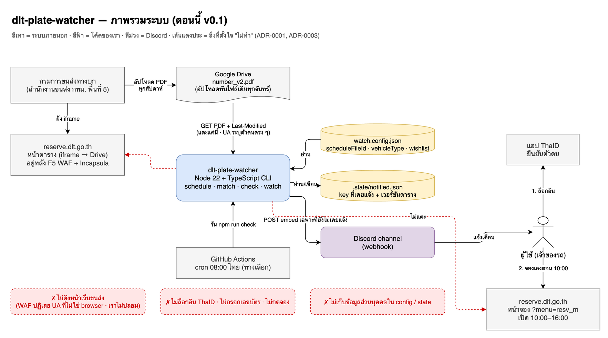

# dlt-plate-watcher

เฝ้าตารางเปิดจองเลขทะเบียนรถของกรมการขนส่งทางบก แล้วแจ้งเตือนเข้า Discord เมื่อเลขที่คุณเล็งไว้กำลังจะเปิดจอง

> **แจ้งเตือนอย่างเดียว ไม่จองแทน** — การจองต้องยืนยันตัวตนผ่านแอป ThaID ด้วยตัวคุณเองทุกครั้ง
> โปรแกรมนี้ไม่ล็อกอิน ไม่กรอกฟอร์ม ไม่ยิงหน้าจอง และไม่หลบระบบกันบอตของขนส่ง ([ทำไม](docs/adr/0001-notify-only-never-book.md))

```
🎯 เลขที่เล็งไว้จะเปิดจอง ศุกร์ 18 กันยายน 2569
รถยนต์นั่งส่วนบุคคลไม่เกิน 7 คน · ช่วงที่เปิด: 8ขฉ 5001 – 6500
เลขที่ตรงเงื่อนไข (3): 8ขฉ 5050 · 8ขฉ 5151 · 8ขฉ 5555
เปิดจอง 10:00 – 16:00 น. · ต้องจดทะเบียนภายใน 18 ตุลาคม 2569
```

## มันทำอะไรให้บ้าง

| เมื่อไหร่ | แจ้งอะไร |
|---|---|
| ขนส่งออกตารางสัปดาห์ใหม่ | สรุปตารางทั้ง 3 ประเภทรถ |
| ตารางมีเลขที่ตรง wishlist | วันเปิด หมวดอักษร ช่วงเลข และเลขที่ตรงพร้อมเหตุผล |
| 1 วันก่อนวันเปิดจองของรถประเภทคุณ | เตือนเตรียม ThaID · เลขตัวถัง · ชื่อตรงบัตร |
| 09:50 น. ของวันที่มีเลขในฝันเปิด (โหมด Vercel) | ปิงว่าอีก 10 นาทีเปิด พร้อมลิงก์หน้าจอง |
| 7 วัน และ 1 วันก่อนหมดเขตจดทะเบียน | เตือนว่าเลขจะหลุดถ้าไม่ไปจด |
| ตารางที่อ่านได้หมดอายุแล้ว | เตือนให้ไปเช็ค file id ใหม่ (ดูด้านล่าง) |

ทุกอย่างถูกจำไว้ (Supabase หรือ `.state/`) จึงแจ้งแต่ละเรื่องครั้งเดียว รัน cron ถี่แค่ไหนก็ไม่สแปม

## เริ่มใช้ใน 5 นาที

ต้องมี Node 22 ขึ้นไป

```bash
git clone https://github.com/VoramethP/dlt-plate-watcher && cd dlt-plate-watcher
npm install
cp watch.config.example.json watch.config.json
cp .env.example .env            # ใส่ Discord webhook URL ของคุณ
```

แก้ `watch.config.json`:

```jsonc
{
  // ลิงก์ PDF ตารางบน Google Drive — วิธีหาอยู่หัวข้อถัดไป (ค่าเริ่มต้นใช้ได้เลย)
  "scheduleFileId": "https://drive.google.com/file/d/1UP-epw_Yxn3j8OrWsj10oKKxind5rktI/preview",
  "vehicleType": "car",         // car = เก๋ง/กระบะ 4 ประตู · van = รถตู้ · pickup = กระบะบรรทุก/2 ประตู
  "wishlist": {
    "numbers": [9, 99, 999, 9999, 1234],            // เลขที่อยากได้ตรง ๆ
    "patterns": ["^(\\d)\\1{2,3}$", "^(\\d)(\\d)\\1\\2$"],  // regex: เลขตอง 3–4 ตัว, เลขคู่สลับ (1212)
    "digitSums": []                                  // ผลรวมเลข เช่น [9, 24] — ระวังตรงเยอะมาก
  },
  "reminders": { "daysBeforeOpen": [1], "daysBeforeRegisterDeadline": [7, 1] }
}
```

แล้วลอง:

```bash
npm run schedule        # ดูตารางสัปดาห์นี้
npm run match           # ดูว่าเลขในฝันจะเปิดวันไหน (ยังไม่ส่ง Discord)
npm run check           # ส่งแจ้งเตือนรายการใหม่เข้า Discord
```

## โหมด Vercel — มีปุ่ม รันตลอดโดยไม่ต้องเปิดเครื่อง (ฟรี)

ปุ่มใต้ข้อความและ cron 08:00/09:50 รันบน **Vercel Functions + Supabase** ([ADR-0005](docs/adr/0005-vercel-interactions-endpoint-supabase.md)):
Discord ยิง interaction มาที่ `api/interactions` (ตรวจลายเซ็นทุกครั้ง) · สถานะทั้งหมดอยู่ใน Supabase (ตาราง `notified` · `wishlist` · `meta` · `events`)
ไม่มี process รันค้างที่ไหน ปิด Mac ได้

### 1. Discord application

1. [discord.com/developers/applications](https://discord.com/developers/applications) → **New Application** → แท็บ **Bot** → **Reset Token** → เก็บเป็น `DISCORD_BOT_TOKEN` (ไม่ต้องเปิด Privileged Intents)
2. แท็บ **General Information** → คัดลอก **Application ID** (`DISCORD_APP_ID`) และ **Public Key** (`DISCORD_PUBLIC_KEY`)
3. แท็บ **OAuth2 → URL Generator** → scopes `bot` + `applications.commands` → permissions **Send Messages · Embed Links · Read Message History · Manage Messages** (+ Pin Messages ถ้าอยากให้ปักหมุดแผง) → เปิดลิงก์เชิญ bot เข้า server
4. ใน Discord: **User Settings → Advanced → Developer Mode** → คลิกขวาช่อง → **Copy Channel ID** (`DISCORD_CHANNEL_ID`) · คลิกขวา server → Copy Server ID (`DISCORD_GUILD_ID` ทางเลือก ทำให้ `/panel` ใช้ได้ทันที)

### 2. Supabase

1. [supabase.com](https://supabase.com) → New project (region **Singapore** ให้ตรงกับ Vercel `sin1`)
2. **Project Settings → Database → Connection string** → **Transaction pooler** (port 6543) = `DATABASE_URL` · **Session pooler** (5432) = `DIRECT_DATABASE_URL`
3. บนเครื่อง: ใส่สองค่านี้ใน `.env` แล้ว `npm run db:migrate` — สร้าง 4 ตาราง (RLS เปิด ไม่มี policy = Data API ปิด โค้ดต่อตรงด้วย connection string)

### 3. Vercel

1. [vercel.com](https://vercel.com) → **Add New Project** → import repo นี้ (Framework: Other · ไม่ต้อง build command)
2. **Settings → Environment Variables** ใส่ทุกตัวใน [`.env.example`](.env.example) ส่วน "โหมด Vercel":
   `DISCORD_BOT_TOKEN` `DISCORD_CHANNEL_ID` `DISCORD_PUBLIC_KEY` `DATABASE_URL` `CRON_SECRET` (สุ่ม `openssl rand -hex 32`) และ `WATCH_CONFIG_JSON` (เนื้อหา `watch.config.json` ทั้งไฟล์ บรรทัดเดียว)
3. Deploy → ได้ URL เช่น `https://dlt-plate-watcher.vercel.app`
4. กลับไป Developer Portal → **General Information → Interactions Endpoint URL** = `https://<app>.vercel.app/api/interactions` → Save (Discord จะยิง PING ทดสอบ ต้องขึ้นว่าบันทึกสำเร็จ)
5. บนเครื่อง `npm run register` (ต้องมี `DISCORD_BOT_TOKEN` + `DISCORD_APP_ID` ใน `.env`) → พิมพ์ `/panel` ในช่องได้
6. `vercel.json` ตั้ง Vercel Cron ยิง `api/cron/check` ทุกวัน 08:00 ไทยไว้แล้ว (แผน Hobby คลาดได้ ±59 นาที ยังทันก่อน 10:00)
7. ปิง 09:50 ต้องตรงนาที → ใช้ [cron-job.org](https://cron-job.org) (ฟรี): URL `https://<app>.vercel.app/api/cron/ping` · เวลา 09:50 Asia/Bangkok ทุกวัน · header `Authorization: Bearer <CRON_SECRET>`

ทดสอบ: พิมพ์ `/panel` → กดทุกปุ่ม · ยิง `curl -H "Authorization: Bearer $CRON_SECRET" https://<app>.vercel.app/api/cron/check` ดูว่าแจ้งเตือน + แผงย้ายมาล่างสุด

**🏠 landing panel** อยู่ล่างสุดของช่องเสมอ บอกสถานะวันนี้ · wishlist · เช็คล่าสุด โดยไม่ต้องกด และมีปุ่ม 2 แถว

| แถว | ปุ่ม |
|---|---|
| ทำ | 🔢 กรอกเลขที่อยากจอง (เพิ่ม / ไม่อยากได้ / ลบ) · 📋 เลขที่เฝ้าอยู่ · 🧹 ลบประวัติแชตเก่า · 🌐 เข้าสู่เว็บไซต์ |
| ดู | 📅 ตาราง · 🎯 เลขในฝัน · 🔄 เช็คตอนนี้ · 📜 ประวัติ (จาก transaction log) · ❓ คู่มือ |

ใต้การ์ดแจ้งเตือนมีแค่ 📤 แชร์เลข (ข้อความล้วนคัดลอกได้) กับ 🌐 เข้าสู่เว็บไซต์ · รายละเอียดทุกปุ่มใน [docs/UI-GUIDE.md](docs/UI-GUIDE.md)
ทุกเหตุการณ์ (ใครเพิ่ม/ลบเลขไหน · แจ้งอะไรไป · ใครลบแชต) ถูกบันทึกในตาราง `events` บน Supabase เก็บตลอด

## ความหมายเลขศาสตร์ (ถ้าอยากได้)

[`numerology.json`](numerology.json) รวบรวมตารางค่าตัวอักษร ผลรวม และคู่เลข จากแหล่งเผยแพร่สาธารณะ 6 แหล่ง (รายชื่อในไฟล์) โดยจดว่าแต่ละรายการมาจากแหล่งไหน การ์ดเลขในฝันจะมีส่วน 🔮 จัดกลุ่มเลขและบอกจำนวนแหล่งที่เห็นตรงกัน
ยังคงเป็นความเชื่อ ไม่ใช่ข้อเท็จจริง · แก้ได้ทุกช่อง · ลบไฟล์ทิ้งถ้าไม่ต้องการ

## วิธีรันบนเครื่อง (ไม่มีปุ่ม)

ถ้าไม่อยากตั้ง Vercel: ใส่ `DISCORD_WEBHOOK_URL` ใน `.env` แล้วรัน `check` ด้วย cron ของระบบ — สถานะเก็บในไฟล์ `.state/` (หรือใส่ `DATABASE_URL` ด้วยจะใช้ Supabase ชุดเดียวกับ Vercel)

```cron
0 8 * * *  cd /path/to/dlt-plate-watcher && npm run -s check >> check.log 2>&1
```

ใช้เป็น fallback ตอน Vercel ล่มได้ทันที เพราะ CLI กับ api/ ใช้ตรรกะเดียวกัน (`src/core.ts`)

## ตารางมาจากไหน แล้วทำไมต้องมี `scheduleFileId`

หน้า [ตารางเปิดจองหมายเลข](https://reserve.dlt.go.th/reserve/v2/?menu=schedule) ของขนส่งฝัง PDF จาก Google Drive ไว้ใน `<iframe>`
โปรแกรมโหลด PDF นั้นตรงจาก Drive แล้วอ่านตารางออกมาเอง (ไม่ต้องลง poppler หรืออะไรเพิ่ม)

เราไม่ดึงหน้าเว็บขนส่งเพื่อหาลิงก์ให้อัตโนมัติ เพราะ WAF ของขนส่งปฏิเสธทุก client ที่ไม่ใช่เบราว์เซอร์
และเราเลือกจะไม่ปลอมตัวเป็นเบราว์เซอร์ ([ADR-0003](docs/adr/0003-manual-file-id-no-ua-spoofing.md))
จากที่สังเกต ขนส่ง**อัปโหลดทับไฟล์เดิม**ทุกสัปดาห์ ค่าเริ่มต้นจึงน่าจะใช้ได้ยาว
ถ้าวันหนึ่งได้รับแจ้ง "ตารางที่ตั้งไว้หมดอายุแล้ว":

1. เปิดหน้าตารางในเบราว์เซอร์ → คลิกขวา → View Page Source
2. หา `drive.google.com/file/d/…/preview` ตัวที่**ไม่ได้**อยู่ในคอมเมนต์ `<!-- -->`
3. วางลิงก์ (หรือ HTML ทั้งก้อนก็ได้ โปรแกรมแกะ id ให้) ลง `scheduleFileId`

## คำสั่งทั้งหมด

```
schedule            พิมพ์ตารางเปิดจองรอบปัจจุบัน
match               พิมพ์เลขใน wishlist ที่จะเปิดจองรอบนี้
check               ดึงตาราง + ส่งแจ้งเตือนรายการใหม่เข้า Discord
preview             ส่ง match ของรอบนี้ทันทีโดยไม่สน state (ดูหน้าตาข้อความ)

--config <path>     ค่าเริ่มต้น watch.config.json
--state <path>      ค่าเริ่มต้น .state/notified.json (มี DATABASE_URL → ใช้ Supabase แทน)
--file-id <id|url>  ใช้ไฟล์ตารางอื่นชั่วคราว
--dry-run           ไม่ส่ง Discord ไม่บันทึก state (พิมพ์ embed ออกจอแทน)

npm run register    ลงทะเบียน /panel (ครั้งเดียว)
npm run db:migrate  สร้าง/อัปเดตตารางบน Supabase จาก drizzle/
```

## แผนภาพ

ไฟล์ [`drawio/dlt-plate-watcher.drawio`](drawio/dlt-plate-watcher.drawio) เปิดด้วย [draw.io](https://app.diagrams.net) มี 9 หน้า: ภาพรวมระบบ · flow ของ `check` · ตรรกะการแจ้ง · parser PDF · watch loop (เดิม) · การ deploy · roadmap · bot และปุ่ม · หน้า raw สำหรับร่าง (หน้า 05/06 ยังเป็นภาพก่อน Phase 6 — ดู ADR-0005)
ดูเป็นรูปได้ที่ [`drawio/png/`](drawio/png/)



## โครงสร้าง

```
api/
  interactions.ts     Interactions Endpoint (ตรวจ Ed25519 → route) · cron/check.ts 08:00 · cron/ping.ts 09:50
src/
  cli.ts              จุดเข้าบนเครื่อง · webhook เท่านั้น
  app.ts              ประกอบของจาก env สำหรับ api/ (คู่ของ cli.ts)
  core.ts             ขั้นตอนหลัก: โหลดตาราง → วางแผนแจ้ง → ส่งเฉพาะที่ใหม่ → บันทึก
  config.ts           schema ของ watch.config.json (Zod) · resolveConfig = env/ไฟล์ + wishlist จาก store
  store.ts            Store interface · fileStore (.state/) · createStore เลือกตาม DATABASE_URL
  db/                 schema.ts (Drizzle) · client.ts · store.ts (Supabase)
  match.ts            จับ wishlist กับช่วงเลขที่เปิด
  numerology.ts       เลขศาสตร์: ผลรวมทั้งป้าย + คู่เลข → สาย (ตาราง numerology.json แก้ได้)
  state.ts            รูปไฟล์ .state/notified.json
  thai-date.ts        พ.ศ./ชื่อเดือนไทย ↔ ISO · เวลาไทย
  schedule/fetch.ts   โหลด PDF จาก Drive (+ Last-Modified เป็นเวอร์ชันตาราง)
  schedule/parse.ts   PDF → แถวตาราง (จัดกลุ่ม text ตามพิกัด y แล้ว regex)
  notify/discord.ts   ประกอบ embed · Notifier interface · webhook
  notify/rest.ts      Discord REST ด้วย bot token (ส่ง/ลบ/ปักหมุด · ไม่มี gateway)
  notify/interactions.ts  route ปุ่ม/modal//panel → response + งานหลังตอบ
  notify/verify.ts    ตรวจลายเซ็น Ed25519
  notify/actions.ts   ตรรกะของปุ่ม (แก้ wishlist, จัดรูปประวัติ) แบบ pure
drizzle/              migration SQL (สร้างด้วย npm run db:generate)
tests/                Vitest · มี PDF จริงของขนส่งเป็น fixture
docs/adr/             เหตุผลของการตัดสินใจสำคัญ
```

```bash
npm test              # 81 tests
npm run typecheck
```

## ข้อจำกัดที่ควรรู้

- ตารางที่รองรับคือของ **สำนักงานขนส่งกรุงเทพฯ พื้นที่ 5** (ระบบกลางของขนส่ง) · เลขประมูล/เลขสวยที่ต้องประมูลไม่อยู่ในนี้
- ถ้าขนส่งเปลี่ยนรูปแบบ PDF โปรแกรมจะพังแบบส่งเสียง (โยน error ว่าอ่านแถวไม่ได้) ไม่พังเงียบ
- ปิง 09:50 อิงเวลาประกาศ 10:00 น. บนหน้าเว็บ ไม่ได้เช็คสถานะจริงจากระบบ
- ประกาศของขนส่ง: ชื่อผู้จองต้องเป็นเจ้าของรถ และห้ามนำเลขที่จองไปจำหน่ายจ่ายโอน มิฉะนั้นถูกยกเลิกโดยไม่แจ้ง

## English summary

Watches the weekly plate-number reservation schedule published by Thailand's Department of Land Transport (a PDF embedded from Google Drive),
matches it against your wishlist (exact numbers, regex patterns, digit sums) and posts Discord alerts:
new schedule, matching numbers, day-before and 10-minutes-before reminders, and registration deadlines.
**Notify-only by design**: it never logs in, never touches the reservation form, and never works around the site's bot protection.
Runs as Vercel Functions (Discord Interactions Endpoint + cron) with Supabase for state, or as a plain Node CLI with a webhook. Node ≥ 22, TypeScript. See `docs/adr/` for the reasoning.

## License

MIT
